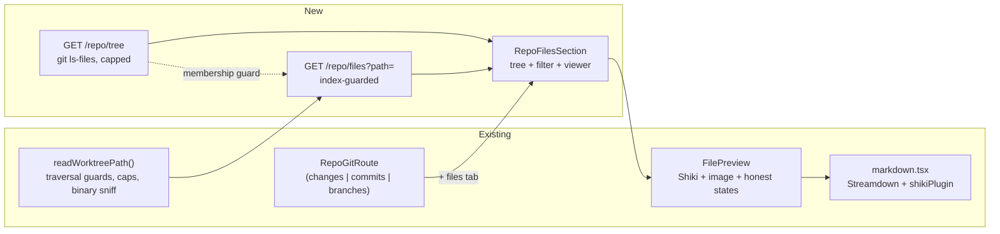

# Repository File Browser on the Git Tab (#1279)

## 📝 TLDR

The cockpit's project **Git** tab (`/git`) can only show what *changed* — Changes, Commits,
Branches. Nothing else in the checkout can be opened, so reading a file an agent did not touch
means leaving for an editor or GitHub. A file browser does exist, but at `/tasks/:id/files`:
it browses one **run's worktree**, lazily, one HTTP request per directory, and it has no search.

This spec proposes a fourth sub-tab, **`/git/files`** — the project repository's own tree on the
left, the file's content on the right, syntax-colored through the existing Shiki singleton and
rendered as formatted Markdown for `.md`, with an instant filter box over the tree. Two additive
routes back it: `GET /repo/tree` (the whole path index in one bounded response, from
`git ls-files`) and `GET /repo/files?path=` (one file, reusing `readWorktreePath`). Because the
index is git's own view of the repository, ignored **untracked** `node_modules` and `.env` files do
not appear; tracked copies remain visible by design. The content route refuses any path the index
does not contain, which keeps an ignored untracked secret unreadable through a route that would
otherwise happily serve it.

Implementation follows separately; this document is the design.

## Resolved assumptions (autonomous defaults)

Written in autonomous mode (`om-spec-writing --autonomous`). These were **not** answered by a
human; each carries the conservative default applied. Override by commenting on #1279 or on this
spec's PR before implementation starts.

| # | Question | Applied default | Why conservative |
|---|---|---|---|
| Q1 | One spec, or split browsing from search? | **One spec, two phases.** Phase 1 ships tree + viewer; Phase 2 adds the filter box. | The scope-cohesion test asks whether each half works without the other. The viewer does; search does not exist without a tree to search. That is a phase boundary, not a spec boundary — and Phase 1 alone is already shippable and useful. |
| Q2 | Tree data: lazy per-directory listings (what the run Files tab does), or the whole path index at once? | **Whole index at once**, one `GET /repo/tree`. | Measured on this repository: 1,939 paths, 99 KB of raw text. One bounded response replaces one request per opened folder, makes search instant and client-side (no second endpoint, no server-side matcher to abuse), and removes the N+1 the lazy tree explicitly warns about. The cap below is what keeps it bounded on a repository far larger than this one. |
| Q3 | Index source: `git ls-files`, or a filesystem walk? | **`git ls-files -z --cached --others --exclude-standard`** from the repo root. | One bounded subprocess instead of a recursive walk, and it respects `.gitignore` for free. A filesystem walk of this repo would spend its entire budget inside four `node_modules` trees before reaching any source. The Git tab already refuses to render outside a git repository, so there is no non-git case to fall back for. |
| Q4 | Does the tree show `.gitignore`d files? | **No.** The tree is exactly what the index lists: tracked, plus untracked-but-not-ignored. | Keeps tree and search showing the same set (an index-backed search cannot find what a wider tree displays), keeps build output and `node_modules` out of a repository browser, and is what "browse the repo" means in GitHub, Gitea and VS Code's source-control view. A `?showIgnored=1` toggle is a later, additive change if anyone misses it. |
| Q5 | Does `GET /repo/files` serve any path inside the root, or only indexed ones? | **Only paths present in the index**, re-derived per request; anything else is `409`. | `readWorktreePath` guards against escaping the root — it knows nothing about `.gitignore`, so without this check `?path=.env` would be served verbatim. AGENTS.md § Zero config states a repository `.env` is never auto-loaded; making it one fetch away from any cockpit client would walk that back. The check is one set membership. |
| Q6 | Search matches paths, or file contents too? | **Paths only.** | Content search is a grep surface with its own cost, cancellation and abuse profile, and the brief asked to "search in that file tree". Deferred to its own spec, where it belongs. |
| Q7 | Gate the new routes behind hosted mode (`CEZ_REMOTE`)? | **No new route-specific gate**, consistent with the existing `/repo/*` family. | The index holds tracked and not-ignored files — content already in the git remote — and `GET /repo/changes` already serves the working tree's full diffs, untracked files included, with no route-specific gate. The new routes inherit the server-wide `/api/*` request-origin guard, remain same-origin/non-CORS, and in hosted mode rely on the deployment's reverse-proxy TLS/auth perimeter. Q5 is the control that keeps ignored untracked secrets out. Reversible: adding a narrower gate later is additive. |
| Q8 | `.md` default view: rendered or raw? | **Rendered**, with a toggle to raw source that persists for the session. | The brief asks for "MD file formatting" by name. Raw stays one click away for anyone reading a spec's table syntax. |
| Q9 | Virtualize the tree? | **No.** Cap rendered search results instead. | Folders start closed, so rendered rows stay in the dozens however large the index is; the one unbounded case is a filter matching thousands of paths, and a result cap with an honest "N more" answers it without taking on `virtua` and the measurement cache it needs. `diff-scroll.ts`'s own doctrine is not to virtualize prematurely. |

None of these is marked `⚠ NEEDS HUMAN CONFIRMATION`: each is reversible, none weakens a
protected surface, and Q5/Q7 together narrow rather than widen what the server will serve.

## 📝 Problem Statement

`RepoGitRoute` (`packages/web/src/routes/repo-git/repo-git.tsx:26-28`) declares exactly three
sub-tabs — `'changes' | 'commits' | 'branches'` — and every one of them is a view *of a diff*:
the working tree against `HEAD`, a commit against its parent, the branch list. The project's
files themselves have no surface in the cockpit.

The gap is most visible exactly where the cockpit is most used. A user reviewing what an agent
just did can read the diff, but not the function the diff calls; not the test that covers it;
not the `AGENTS.md` rule the reviewer is about to cite. The cockpit's whole premise is watching
agent work without leaving it, and today the most ordinary follow-up question — "what does the
rest of this file look like?" — sends the user to another window.

The machinery to answer it already exists, in the wrong scope:

- `GET /runs/:id/files?path=` (`packages/cezar/src/server/server.ts:4688`) serves a directory
  listing or one file's content from a **run's worktree**, delegating to `readWorktreePath()`
  (`packages/cezar/src/server/git-changes.ts:537`).
- `FilesTree` (`packages/web/src/routes/task-git/files-tree.tsx:16`) renders that lazily — one
  request per folder, folders closed by default because an open-by-default tree "would fan out
  into one request per directory and defeat the lazy contract".
- `FilePreview` (`packages/web/src/routes/task-git/file-preview.tsx:20`) renders the content:
  Shiki-highlighted text via `langForPath`, inline `` for images, and honest `too-large`,
  `binary` and `409` states.

Both are bound to a `runId`. The project checkout — the thing `/git` is already a view of — has
no equivalent. `.ai/specs/2026-07-20-worktree-file-editing.md` (Q7) considered extending that
work to `/api/repo/*` and declined: *"The repo checkout is the user's real working tree, with no
worktree isolation to fall back on. Separate capability, separate spec."* This is that spec, for
the read half only.

Neither existing tree has a filter input — verified across `changes-tree.tsx`, `files-tree.tsx`
and both git route folders. Search is genuinely new.

## 📝 Proposed Solution

A **`/git/files` sub-tab** on the existing repo route, built on two additive, project-scoped
routes and the components that already render files elsewhere in the cockpit.

The one real design choice is where the tree's shape comes from. The run Files tab discovers it
lazily, directory by directory, because a worktree has no cheap whole-tree answer. A git
repository does: `git ls-files` prints the entire set in one bounded subprocess, already filtered
by `.gitignore`. Taking that answer whole changes the feature's character — the tree arrives in
one response, expanding a folder costs nothing, and **search becomes a client-side filter over an
array the browser already holds**, which is why Phase 2 needs no endpoint of its own.



**Takeaway:** every box on the left exists today and is reused as-is or with its data source
lifted; the only new server logic is one `git ls-files` call and the membership check that ties
the content route to it.

### Alternatives considered

- **Reuse `FilesTree` as-is, parameterized by source.** Rejected as the tree's basis: it would
  inherit the lazy contract and its N+1, and search over a tree whose branches have not been
  fetched is not implementable without a second endpoint. `FilePreview` *is* reused this way —
  its coupling is a single `useRunFile` call, and lifting it is a small, honest change.
- **A server-side search endpoint.** Rejected: with the index already in the client it answers a
  question nobody has, and adds a matcher reachable over HTTP.
- **A recursive filesystem walk for the index.** Rejected per Q3 — slower, unbounded, and it
  surfaces exactly the directories a repository browser should not show.
- **Serve the tree as nested JSON.** Rejected: a flat path array is smaller on the wire, trivial
  to filter, and the cockpit already owns a flat-paths-to-tree builder in
  `packages/web/src/routes/task-git/file-tree.ts` (`buildFileTree`, with single-child chain
  compaction) that generalizes to it.

## 📝 Architecture

**Server** — one new family member each, both chained into the existing `repoRoutes` builder in
`packages/cezar/src/server/server.ts:5844` (chaining, not a loose `app.get`, per AGENTS.md § The
HTTP API — a loose statement vanishes from `AppType` and the typed client stops seeing it):

- `GET /repo/tree` → `getRepoInfo(repoRoot)`; `409 { error: 'not a git repository' }` when absent,
  matching `/repo/changes`. Then a new `listRepoPaths(root)` in
  `packages/cezar/src/server/git.ts` (beside `getStatus`/`getBranches`, which already own the
  `git` subprocess idiom) runs `git ls-files -z --cached --others --exclude-standard`, splits on
  NUL, sorts, and caps both the number of entries and the captured bytes. The helper must return a
  bounded failure rather than a partial tree when the byte cap is exceeded.
- `GET /repo/files?path=` → the same handler shape as `/runs/:id/files` with the run lookup
  replaced by `getRepoInfo`, plus the Q5 membership check before `readWorktreePath`.

`readWorktreePath` is reused unchanged and remains the only path resolver: NUL rejection, lexical
containment, `.git` refusal, final-component symlink refusal, and the authoritative `realpath()`
re-containment for symlinked intermediate directories, plus `FILE_CONTENT_CAP` (512 000) and the
`sniffBinary` NUL check. Hand-rolling a second resolver is the failure mode this reuse exists to
prevent.

**Contract** (`packages/contract/src/repo.ts`) — `repoTreeSchema` is new; `repoFileQuerySchema`
is also new and is the single source for the file route's request shape:
`{path: z.string().min(1), raw: z.enum(['0', '1']).optional()}`. Missing/invalid query values are
rejected by `queryZodValidator` before the handler. `worktreeEntrySchema` (`:133`) describes the
JSON representation and is reused verbatim; the opt-in `raw=1` image representation is explicitly
bytes with the existing response headers, not JSON and not passed through `unwrap`. Both JSON
request/response shapes are zod schemas with types inferred via `z.infer`, and the implementation
must add route-parity tests for the JSON branch plus a raw-image response test.

**Client** — `getRepoTree()` and `getRepoFile(path)` in `packages/web/src/api/client.ts` beside
`getRepoChanges` (`:738`), plus `repoFileRawUrl(path)` mirroring `runFileRawUrl` (`:1111`) for
``. Hooks `useRepoTree()` / `useRepoFile(path)` in `queries.ts` next to `useRepoChanges`
(`:1259`), both `retry: false` — the family convention that a `409` is an answer, not an outage.

**UI** — `RepoFilesSection` in `packages/web/src/routes/repo-git/repo-files.tsx`, a sibling of
`RepoChangesSection`. `RepoTab` gains `'files'`; `repo-git.tsx` gains one `TabLink` and one
branch. Routes `git/files` and `git/files/*` in `packages/web/src/routes.tsx:385-421` (a splat,
because a file path contains slashes) both render `<RepoGitRoute tab="files" />`.

**Reuse seams, and the one change each needs:**

| Component | Today | Change |
|---|---|---|
| `FilePreview` (`file-preview.tsx:20`) | takes `runId`, calls `useRunFile` | take a `source: { kind: 'run'; runId } \| { kind: 'repo' }`; one `useFileEntry(source, path)` hook branches the query key and fetcher. No conditional hook calls. |
| `buildFileTree` (`file-tree.ts:53`) | `ChangedFile[]` → `TreeDir` with ± counts | extract the generic path-splitting + compaction; the changed-files builder layers counts on top. |
| `markdown.tsx:27` `shikiPlugin` | module-local | export it (or lift to `lib/`) so the file viewer renders Markdown through the same single Shiki. |
| `readWorktreePath`, `langForPath`, `highlight*`, `TabLink`, `CenteredState` | — | unchanged. |

No new dependency: `streamdown ^2.5.0`, `shiki ^4.3.1` and `virtua ^0.49.3` are already in
`packages/web/package.json`. Adding `react-markdown`, `marked` or a second
`createHighlighterCore` would each violate `packages/web/src/lib/highlighter.ts`'s stated contract.

## 📝 API Contracts

### `GET /api/v1/p/:projectId/repo/tree`

```ts
// packages/contract/src/repo.ts
export const repoTreeSchema = z.object({
  /** Repo-relative POSIX paths, sorted; tracked + untracked-not-ignored. */
  paths: z.array(z.string()),
  /** True when the repository has more paths than REPO_TREE_CAP; `paths` is the first cap. */
  truncated: z.boolean(),
})
export type RepoTree = z.infer<typeof repoTreeSchema>
```

- `200` — the index. `REPO_TREE_CAP = 20_000` paths and `REPO_TREE_BYTES_CAP = 8 MiB` of
  captured `git ls-files` output (this repository: 1,939 paths / 99 KB, so the count cap is ~10×
  headroom). The byte cap is the hard bound for unusually long paths; exceeding it is a 409 git
  failure, never a partial successful tree.
- `409 { error: 'not a git repository' }` — same wording and status as `/repo/changes`.
- `409 { error: <first line of git's stderr> }` — `git ls-files` failed; `gitReason` already
  produces this one-line form.

### `GET /api/v1/p/:projectId/repo/files?path=<rel>[&raw=1]`

Response: the existing `worktreeEntrySchema` — but only its `file` member is reachable, since
every indexed path is a file. Behavior mirrors `/runs/:id/files` exactly, including
`vary: Accept`, the `Accept: image/*` negotiation, and the raw-image response headers
(`content-type`, `x-content-type-options: nosniff`,
`content-security-policy: default-src 'none'; style-src 'unsafe-inline'; sandbox`).

- `200` `{ type: 'file', path, size, binary, tooLarge, content? }` — `content` absent exactly when
  `binary` or `tooLarge`, as the schema already documents.
- `200` raw image bytes for `?raw=1` on an image extension within the cap; this is the documented
  non-JSON branch of the mixed-format route, selected only by the validated `raw` query value.
- `409 { error: 'not a git repository' }`.
- `409 { error: 'path is not in the repository index: <path>' }` — **the Q5 guard**: the path is
  absent from (or excluded by) `git ls-files`. Deliberately the same wording for "ignored",
  "untracked-and-ignored" and "does not exist", so the response does not disclose whether an
  ignored file is present on disk.
- `409 { error: … }` — `readWorktreePath`'s own refusals (symlink, `.git`, escaping, NUL), in the
  server's existing words.
- `400` for a missing/empty `path` or a `raw` value other than `0`/`1`, from query middleware.
- `409` for `?raw=1` on a non-image or an over-cap file, reusing the current message shapes.

Both routes are **additive**: no existing route, field, status or message changes. `GET` stays a
pure read — neither touches the index, matching the `intentToAdd: false` care `/repo/changes`
already takes with the user's real working tree.

## 📝 UI/UX

**Layout.** The established two-pane split, matching `/tasks/:id/files`: tree left (resizable,
sticky), content right. Below the `md` breakpoint the Changes views hide their tree and force
unified+wrap; the Files tab must **not** copy that — `task-files.tsx:21-23` keeps its tree on
small screens precisely because it is the only way to pick a file. On mobile the tree and the
viewer swap: the tree is the view until a file is picked, with a back control.

**Tree.** Folders closed by default; the path to the selected file is auto-expanded, so a
deep-link to `packages/web/src/routes/repo-git/repo-files.tsx` opens with its ancestors already
open. Single-child folder chains are compacted (`packages/web/src/.../routes/repo-git` on one
row), as `buildFileTree` already does for changed files. Rows show the file name, folders their
compacted segment; no ± counts — this is not a diff.

**Deep links.** `/git/files/<path>` is the file's URL, so a selection survives a refresh and can
be pasted to a colleague. Selecting a file replaces (not pushes) history while arrow-keying
through a folder, so Back leaves the tab rather than walking the last twenty selections.

**Viewer.** Text through `FilePreview`'s existing Shiki path; images inline; `binary`,
`too-large` and `409` keep their current honest states. `.md` renders through Streamdown with a
`Rendered | Source` toggle in the pane header, defaulting to rendered (Q8); the choice persists
for the session so a user reading several specs is not re-toggling.

**Search (Phase 2).** A filter input above the tree, auto-focused on `/` and cleared on `Escape`.
Matching is a case-insensitive subsequence over the full repo-relative path (so `webrepofiles`
finds `packages/web/src/routes/repo-git/repo-files.tsx`), ranked: basename matches above path
matches, shorter paths above longer. While filtering, the tree flattens to a result list of full
paths — a filtered hierarchy hides the matched name behind collapsed ancestors, which is the
mistake every file-finder learned from. Results are capped at 200 with a "N more — refine the
filter" footer (Q9). Empty result: "No file matches `<query>`."

**Accessibility.** The tree is a `role="tree"` with `treeitem` rows, `aria-expanded` on folders
and roving `tabindex`; ↑/↓ move, ←/→ collapse/expand, Enter opens. The filter input is a labelled
`type="search"` with `aria-controls` pointing at the result list and a polite live region
announcing the result count. Every state the viewer can show has a text equivalent — the existing
`CenteredState` usages already provide this.

**Empty and degraded states.** Not a git repository: the route already renders "Not a git
repository" before any sub-tab draws. Index truncated: a dismissible banner above the tree —
"Showing the first 20,000 files; this repository has more." Index empty (a fresh `git init`):
"No files yet — nothing is tracked in this repository."

Prototype: none — see §Review limits.

## 📝 Edge Cases & Failure Scenarios

| Scenario | Behavior |
|---|---|
| Path in the index, deleted from disk between tree load and click | `readWorktreePath` → `missing` → `409`; the viewer shows the server's wording. A manual refresh re-reads the index. |
| File changes on disk while open (an agent is working) | The pane shows what it fetched. `useRepoTree`/`useRepoFile` follow the family default (`refetchOnWindowFocus`), so returning to the tab refreshes. No polling: the sync doctrine is that `/repo` is not on the SSE stream. |
| Index path is a symlink | Refused by `readWorktreePath` with its existing symlink message. `git ls-files` lists symlinks, so this is reachable, not theoretical. |
| `.env` or `node_modules/**` requested directly | `409 path is not in the repository index` (Q5). The one case this spec exists to get right. |
| A tracked file named `.git/...` via a nested repo or `.gitattributes` trickery | `readWorktreePath`'s `.git` refusal fires regardless of the index. Both guards are independent and both run. |
| Submodule entry | `git ls-files` lists the submodule as one path; `readWorktreePath` resolves it to a directory. Serve the directory as `409` with its existing wording rather than inventing a submodule view. |
| Repository with >20 000 paths | `truncated: true`, banner shown, search honestly scoped to the loaded index. |
| `git ls-files` slow or hung on a huge or network checkout | It inherits `git-changes.ts`'s `execFile` idiom (`maxBuffer` 32 MB, never throws — `{ ok: false }`). Issue #1206 is bounding subprocesses on repo reads; this call adopts whatever bound lands there rather than inventing a second timeout. |
| Oversized single file (>512 KB) | `tooLarge: true`, no `content`; the existing "too large" state. Unchanged cap. |
| File >1500 lines | Highlighting skipped, plaintext rendered — `HIGHLIGHT_MAX_LINES`, the cap `diff-view.tsx` and `file-preview.tsx` already share. |
| Markdown that is enormous or adversarial | Streamdown renders it with the same link-safety config the thread uses; the `Source` toggle is always available as the escape hatch. |
| Filter matching every path | Capped at 200 rendered rows with the "N more" footer. |
| Hosted mode (`CEZ_REMOTE`) | No new gate (Q7); the index membership check is the control. |

## 📝 Risks & Impact Review

- **Protected surface — `BACKWARD_COMPATIBILITY.md` §2 (HTTP API).** Two new routes, no change to
  any existing one. Additive, so nothing is owed beyond documenting them in §2 in the same PR.
  The repo's own rule is that an undocumented surface is a bug.
- **Reading the user's real checkout, not an isolated worktree.** This is the material difference
  from #530's subject matter and the reason Q5 exists. The mitigation is structural: the content
  route can only serve what `git ls-files` returned, so the set of readable files is exactly the
  set already committed to or deliberately left untracked-and-unignored. A reviewer should treat
  the membership check and its test as the load-bearing part of this spec, not polish.
- **No write path.** Nothing here mutates the working tree. Editing the repo checkout remains out
  of scope and un-specified — a deliberate continuation of the #530 Q7 boundary, not an oversight.
- **Reversibility.** Both routes are additive and the UI is one sub-tab: reverting is deleting a
  tab link, a route and two handlers. No schema, no state file, no config. The one choice that
  would be awkward to reverse is the index-as-tree-source (Q2/Q3), because search depends on it;
  that is why the cap and the `truncated` flag are in the contract from the first version rather
  than added later.
- **Interaction with in-flight work.** #1217 (bounded concurrency for `readWorktreePath`'s
  directory-listing loop) touches the `info.isDirectory()` branch; this spec does not use that
  branch (every indexed path is a file), so the two do not collide. #1206 (bounding subprocesses
  on repo reads) owns the `ls-files` timeout question. Check both diffs before implementing.
- **Not verified.** No implementation exists, so no behavior here is observed: the path counts in
  Q2 are measured on this repository, everything else is design. Performance on a 100 000-file
  repository is inferred from the cap, not tested.

## 📋 Phasing

- **Phase 1 — Browse and view.** The sub-tab, both routes, tree, viewer, Markdown rendering.
  Independently shippable and independently useful: it closes the "I cannot read that file"
  gap entirely.
- **Phase 2 — Search.** The filter box over the index Phase 1 already loads. No server work.

Deferred to their own specs, listed so a reader knows they were considered: content (grep)
search, editing repo files, viewing a file at an older commit, blame, and a `?showIgnored=1`
toggle.

## 📋 Implementation Plan

Each step leaves the application working and is verifiable by a test.

### Phase 1 — Browse and view

1. **Contract.** Add `repoTreeSchema` + `RepoTree` to `packages/contract/src/repo.ts`, with the
   doc comment naming the route. *Test:* the contract's existing parity suite compiles; a schema
   unit test pins `truncated` as required.
2. **Index helper.** Add `listRepoPaths(root, cap = REPO_TREE_CAP, bytesCap = REPO_TREE_BYTES_CAP)` to
   `packages/cezar/src/server/git.ts` — `git ls-files -z --cached --others --exclude-standard`,
   NUL split, drop the trailing empty, sort, slice, return `{ paths, truncated }`. *Test:* a
   fixture repo with a tracked file, an untracked file, a `.gitignore`d file and a file with a
   space and a UTF-8 name; assert the ignored one is absent, ordering is stable, and `truncated`
   flips at the cap; a generated long-path fixture exceeds `bytesCap` and returns `{ ok: false }`
   without a partial list. Non-repo → `{ ok: false }` path.
3. **`GET /repo/tree`.** Chain it into `repoRoutes`; `getRepoInfo` → 409 wording identical to
   `/repo/changes`. *Test:* 200 shape, 409 outside a repo, 409 on a failing `ls-files`, and a
   `contract-parity` assertion that the route's inferred type matches `repoTreeSchema`.
4. **`GET /repo/files`.** Chain it in with the new `repoFileQuerySchema` through
   `queryZodValidator`; derive the index, reject non-members with the Q5 message, then
   `readWorktreePath`; mirror the raw-image negotiation and headers from `/runs/:id/files`. The
   helper uses an explicit byte cap below its `execFile` `maxBuffer` (or a streaming equivalent),
   so the 20,000-entry count cap is not the only bound. *Test (the security-critical one, written
   first):* an ignored untracked `.env` present on disk → 409; a tracked `.env` is served because
   it is in the index; `../outside` → 409; a symlink → 409; `.git/config` → 409; a tracked text
   file → content; a tracked PNG with `?raw=1` → bytes with `nosniff` and the sandbox CSP; an
   over-cap file → `tooLarge`, no `content`; local and hosted requests retain the server-wide
   origin/auth boundary and the route is not CORS-enabled.
5. **Client + hooks.** `getRepoTree`, `getRepoFile`, `repoFileRawUrl` in `client.ts`;
   `useRepoTree`, `useRepoFile` in `queries.ts`, both `retry: false`. *Test:* the existing
   api-client suites; a query test asserting no retry on 409.
6. **Generic tree builder.** Extract path-splitting and single-child compaction out of
   `buildFileTree` (`file-tree.ts:53`) into a builder over plain paths; re-express the changed-files
   builder on top of it. *Test:* the existing `file-tree` suite must pass unchanged (this is the
   regression guard), plus new cases for plain paths, compaction and dirs-first ordering.
7. **`RepoFilesSection` + tree.** New `repo-files.tsx` rendering the tree from `useRepoTree`,
   closed folders, selection state, the truncated banner and the empty state. *Test:* component
   tests for render, expand/collapse, selection, truncated banner, empty index.
8. **Tab wiring.** `RepoTab` gains `'files'`; one `TabLink` in `repo-git.tsx`; `git/files` and
   `git/files/*` routes in `routes.tsx`. *Test:* extend `repo-git.test.tsx:164-166`, which already
   asserts the exact sub-tab link set, and add a deep-link test that `/git/files/a/b.ts` selects
   `a/b.ts` with its ancestors expanded.
9. **Viewer reuse.** Change `FilePreview` to take a `source` discriminant and route both callers
   through one `useFileEntry(source, path)` hook; update `task-files.tsx` to pass
   `{ kind: 'run', runId }`. *Test:* the existing Files-tab tests must pass unchanged; new tests
   for the repo source, including the 409 state.
10. **Markdown.** Export `shikiPlugin` from `markdown.tsx` (or lift it to `lib/`), render `.md`
    through Streamdown with a `Rendered | Source` toggle defaulting to rendered. *Test:* a `.md`
    file renders headings/lists as elements; the toggle shows the raw text; a non-`.md` file never
    shows the toggle; assert no second `createHighlighterCore` (the highlighter module's own test
    hook, `resetHighlighterForTests`, makes this checkable).
11. **Docs.** `BACKWARD_COMPATIBILITY.md` §2 gains both routes; `docs/reference.md` gains the tab.
    No new `CEZ_*` var, so `.env.example` is untouched. *Test:* the repo's docs/lint gate.

### Phase 2 — Search

12. **Matcher.** A pure `matchPaths(paths, query, limit)` in its own module: case-insensitive
    subsequence, basename-first then shorter-path ranking, capped, returning
    `{ results, total }`. *Test:* a table-driven suite — ordering, cap, empty query returns the
    tree unfiltered, no match, unicode and spaces.
13. **Filter UI.** The input, the flattened result list, the "N more" footer, the empty-result
    message, `/` to focus and `Escape` to clear. *Test:* typing filters; results are flat full
    paths; the cap footer appears past the limit; `Escape` restores the tree.
14. **Keyboard + a11y pass.** Roving `tabindex`, ↑/↓/←/→/Enter on the tree, the live region on
    the result count. *Test:* keyboard-navigation component tests; an axe assertion on the
    section if the suite already has that helper, otherwise explicit role/aria assertions.
15. **End-to-end.** One e2e: open `/git/files`, filter for a file the current diff does not
    contain, open it, confirm highlighted content, then open a `.md` and confirm rendered output.
    *Note:* per `.ai/` history the browser e2e suite runs in no CI workflow — this test is written
    for local/QA execution and must not be relied on as a merge gate.

## 📝 Review limits

What this design rests on, and what it does not:

- **Verified by reading the code on `dab947e9`:** every file path, line number, exported name and
  constant cited above — the `RepoTab` union, the `repoRoutes` chain and its 409 wording,
  `readWorktreePath`'s guard order and caps, `worktreeEntrySchema`, `buildFileTree`, the Shiki
  singleton's contract, and the absence of any filter input or write route.
- **Measured on this repository:** the 1,939-path / 99 KB index figure behind the Q2 and cap
  decisions (`git ls-files --cached --others --exclude-standard`).
- **Not verified:** no implementation exists, so nothing here is observed behavior. Performance on
  a repository near the 20 000-path cap is inferred from the cap, not tested, and the
  `git ls-files` latency on a network or virtualized checkout is unmeasured.
- **No visual evidence.** Mockups and current-app screenshots were not produced: no browser can
  launch in this environment (the bundled Chromium fails with a missing `libnspr4.so`, and the
  host has no route to install it). The UI/UX section is therefore prose-only and would benefit
  from a mockup pass before Phase 1's UI steps.
- **Scope cohesion was reviewed by the author, not by a fresh reader.** The spec-writing process
  asks for that check to be delegated to a reviewer with no prior context; that delegation was not
  available in this run, so Q1's one-spec-two-phases conclusion carries an author's bias toward
  the scope they just designed. It is the first thing a human reviewer should re-test.
